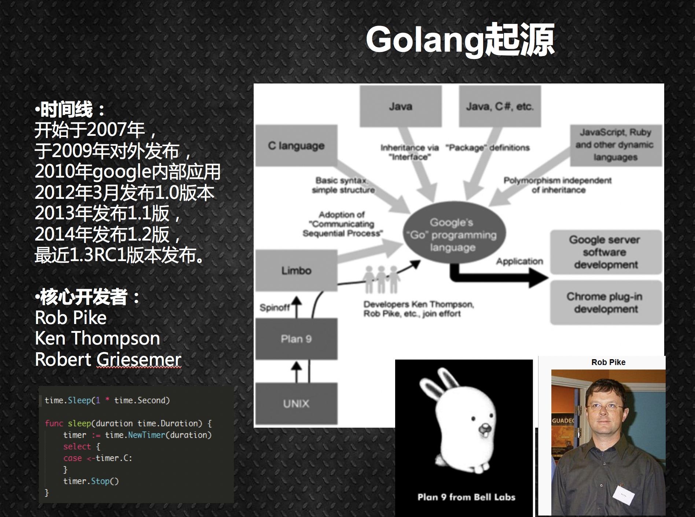
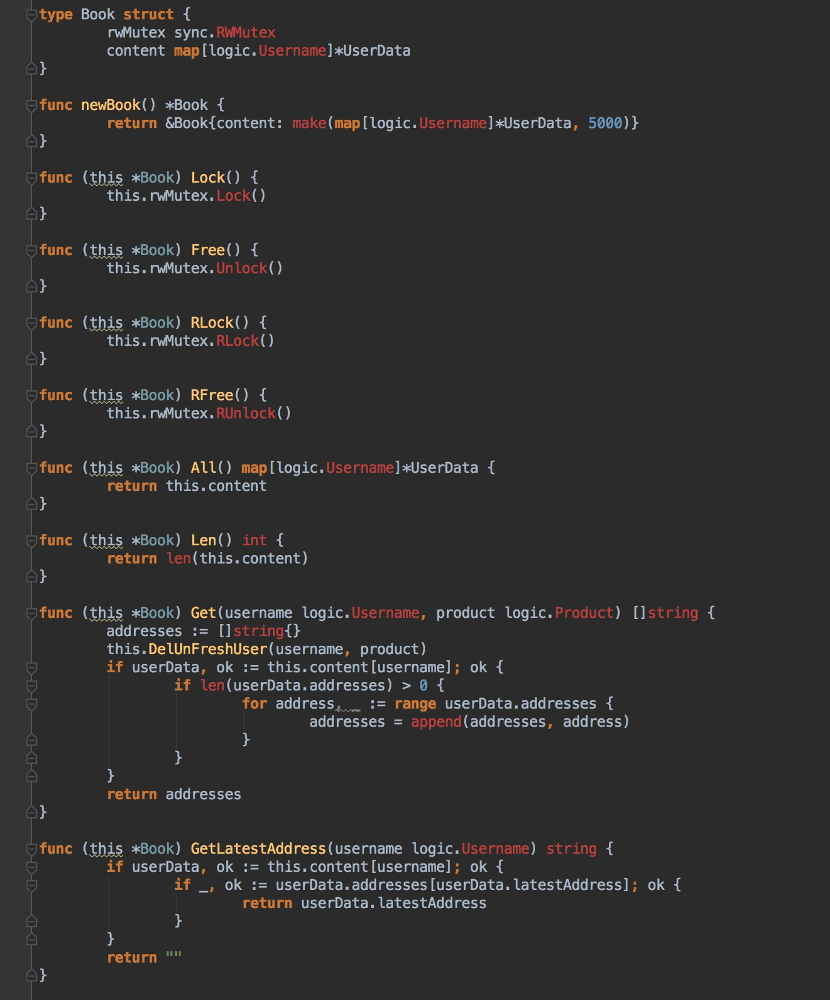

# 花椒golang培训基础篇（持续更新中）

## 1. 背景与起源



#### 1.1 作者都是资深的c和c++程序员，都就职于google.
* Thompson是图灵奖得主，unix之父，C语言的前身，B语言的创造者，plan9操作系统创始人之一.
* Rob Pike也是Unix开发组成员，另外和KenThompson一起开发了UTF-8编码.go语言的前身，Limbo语言的作者
* Robert Griesemer 是v8 JavaScript引擎作者 google GFS开发者之一（15年有幸见到作者，并与go team产品和技术邮件协作，在官博发表了golang在实时通信领域的案例: https://blog.golang.org/qihoo ）

#### 1.2 关于plan9操作系统：
* all system interfaces, including those required for networking and the user interface, are represented through the file system rather than specialized interfaces 
* 一个理想化的操作系统，与常用操作系统API和设计理念差距有点大，没能得到广泛推广。但Plan9操作系统的建立，衍生了plan9 C和plan9 汇编，两个可以被复用的强大体系，对日后go语言的发展有很大影响。plan9和go语言的关系，从plan9的logo，这个大家耳熟能详的兔子，就能感受出来

#### 1.3 golang与plan9

* 在经过plan9之后，rob pike发明了现代go语言的前身，limbo语言，这个语言是建立在虚拟机之上的。跨平台方案固然不错，但效率上可能与c和c++比，还有差距。加入google之后，三位专家，根据google使用c和c++现状，发明了其一个替代方案，即go语言。09年发布，并对内部推广。

#### 1.4 golang早期问题

* 360消息系统大概建立时间是2012年6月份，当时是1.0版本左右。还有很多bug,比如，想sleep 1s，本来可以调用语言原生api(sleep)的。但由于有内存泄漏，需要自己封装。Map在较大的时候，内存有泄漏，等等坑。不过这些目前已经修复了... go的版本迭代还是比较稳健的，1.1版本有大的改动，就是支持并行gc了，1.2版本都是小的修改。1.3版本又有很多新的改进，增加了新特性，可以看下官方ppt。


## 2. Why GO ?


### 2.1诞生背景
##### 编译速度
* Google的中服务器最主要是C++编写的，除此之外还有很多Java、Python代码。另外，Google还有数千名工程师、无数行代码、庞大的分布式构建系统以及数不清的机器（我们认为相对于一个中等规模的集群）。Google的开发可能很慢，甚至笨拙，但它总是很有效。即使在Google的分布式构建系统的的帮助下，大型构建工程依然会花费不少时间（以其中一个二进制文件为例，在2007年花了45分钟，现在是27分钟）。生活质量还是太低。
* 而Go语言则是为了解决这些问题而设计的，它在语言设计的时候，对编译速度都作为一个重要的指标来考核。目前360长连服务代码，几百个文件，全部编译一次，不超过10s，单独编译某一个组件，时间在秒级别。基本上可以保证开发调试，dump数据，马上编译通过，运行，来看结果。非常方便.

##### 依赖性控制
* C语言的依赖一直是个大问题，包括依赖叠加、编译时引入依赖的情况都很难处理，同时你也没办法查清哪些依赖是可以删除的，那些不可以。在C++中，这一点变得更加明.

##### 设计理念
* 适合大型程序，大型团队以及拥有大量依赖的应用。所谓的大型程序，大量依赖的应用，缺点往往是运维成本很高。go原因不需要安装各种让人头疼的依赖，不需要搭建各种运行环境，部署非常方便。
    > 从C++和Java转向Go的程序员很怀念使用类型编程的方式，特别是继承和子类这样的概念。当你用类型编程思想，设计对外接口的时候，你需要决定什么东西封装在什么里面，父类型是什么？两个相关的类，到底是A继承B还是B继承A。一个好的设计，是一个好的抽象过程。go语言设计者认为，把精力集中于这些有点荒谬，真正重要的是这些类能为你做什么而不是它们之间是什么关系！如果说C++和Java是关于类的层次和分类，那么Go的核心思想就是组合（composition）

* 易于接近。事实上go语言的设计是这样评价的：以C语言为原型，以c++为目标设计。修补部分明显的缺陷，去掉垃圾功能，添加一些缺失的功能。既然go语言源自c语言，大量的c语言开发程序员，可以很快上手。

    > Rob提到：事实上在google内部golang吸引了更多的ruby，python程序员。c++程序员的不安全感我感觉占了很大因素。既然大家选择了c/c++总是希望，一切可控，当go的好处是希望让程序员的工作更简单。

* 适合多核架构，适合网络开发，适合并发场景的开发，io密集型
    > 对于是否适合web开发，我保持沉默，PHP是世界上最好的语言。
* 清晰的依赖，清晰语法，清晰语义(鸭子类型，静态编译，阻塞编程)
    > 告别依赖的静态编译，丢弃类型继承和多态，使用鸭子类型的接口隐式实现。内建string,slice,map常规数据结构，没有模板，没有异常。
* 简单的模型
    > 垃圾回收，并发，跨平台对开发者提供了友好的屏蔽。C++程序员不愿意转向Go，是因为他们竭尽全力为了对自己的程序的完全掌控。对于他们，软件并不仅是完成工作，而是更极致的做好工作。但golang带来的生产力上的解放，避免各种复杂体系开源库的拼凑（boost?），一定程度带了了另一种层次的对程序的完全掌控。更像哲学问题，不讨论。

* 便捷的工具（go tool gofmt godoc gofix）

    > Go在设计上做了一个方向性的定位，并没有提及UI，数据分析等方向。虽然现在很多热心的项目在把go往这些方向发展。

## 3. golang开发必备条件反射
### 循环中的协程使用变量问题
CASE 1 打印10个数字,基础并发与乱序，当替换成复杂场景是否能review出来问题所在

```
func main() { 
for i := 0; i < 10; i++ { 
go func() { 
    fmt.Println(i) 
}() 

```

```
func main() { 
for i := 0; i < 10; i++ { 
    go func(i int) { 
        fmt.Println(i) 
    }(i) 
} 
```

### Slice and Array
* 理解make的两个参数，理解底层reslice实现，注意初始化时的优化

```
// https://play.golang.org/p/YQEYuQCF12
package main

import (
	"fmt"
)

func main() {
	s := make([]int, 3, 3) 
	s = []int{1,2,3}

	// another := []int{4,5,6}
	another := []int{4,5}

	s2 := append(s[:1], another...)
	
	fmt.Println(s,s2)

}

```

### defer的使用
* 强迫症同学要注意 请对比运行代码段1与代码段2是否有区别，请对比运行代码段3是否有区别。线上现象如偶发崩溃时候，注意review这个细节。

```
// 代码段1
// https://play.golang.org/p/I6j5oIiDZ0
package main
import (
	"fmt"
	"os"
)
func main() {
	file, err := os.Open("foo.txt")
	defer file.Close()
	if err != nil {
		fmt.Println("file name is: ", file)
		return
	}
}
```

```
// 代码段2
package main
import (
	"fmt"
	"os"
)

func main() {
	file, err := os.Open("foo.txt")
	if err != nil {
		fmt.Println("file name is: ", file)
		return
	}
	defer file.Close()
}
```


```
// 代码段3
package main

import (
	"errors"
	"fmt"
)

func main() {

	b, err := open("")
	defer b.close()
	if err != nil {
		return
	}
	// defer b.close()
}

type myint int

func (mt *myint) string() {
	fmt.Println("result is:", *mt * *mt)
}

func open(fileName string) (*myint, error) {
	if fileName == "" {
		return nil, errors.New("there is a error")
	}
	var b myint = 5
	return &b, nil
}

func (mt *myint) close() {
	fmt.Println("close: ", *mt)
	mt.string()
}
 
```
上面两个例子想强调问题：反复阅读官方文档，其实官方文档都有说明
> the arguments to the deferred function (which include the receiver if the function is a method) are evaluated when the defer executes, not when the call executes. Besides avoiding worries about variables changing values as the function executes, this means that a single deferred call site can defer multiple function executions. Here's a silly example.  

* 容易忽略的问题,闭包对变量的“延迟”读取

```
// tell me the difference
func (this *object) test(){
     defer this.redis.close()
     this.redis = getNewRedis(redis)
}
func (this *object) test(){
     defer func(){
        this.redis.close()
     }()
     this.redis = getNewRedis(redis)
}
```


### 方法集
读官方文档比较绕的环境，建议大家寻找和补充例子:
> A type may have a method set associated with it.  
> 
> The method set of any other type T consists of all methods declared with receiver type T.
>  
> The method set of the corresponding pointer type *T is the set of all methods declared with receiver *T or T (that is, it also contains the method set of T). 
> 
> The method set of a type determines the interfaces that the type implements and the methods that can be called using a receiver of that type.

```
package main

import "fmt"

type t1 int
type t2 int

func (t *t1) String() string { return "ptr" }

func (t t2) String() string { return "val" }

func main() {

	// var a t1 // type T consist all method declared with receiver type t1
	// var ai fmt.Stringer = a // Error: cannot use a (type t1) as type fmt.Stringer in assignment

   
    var b *t1 // type *T is the set of all methods declared with receiver *t1 or t1
    var c t2  // type T consist all method declared with receiver type t2
    var d *t2 // type *T is the set of all methods declared with receiver *t2 or t2 当调用string方法时候，仍旧是receiver value copy

	var bi, ci, di fmt.Stringer = b, c, d

	fmt.Println(bi, ci, di)
	fmt.Println(b, c, d)

}


```

### timer相关
* 请描述下面程序问题，什么时候打印 "10s timer"

```
func demo(input chan interface{}) {
    for {
        select {
        case msg <- input:
            println(msg)

        case <-time.After(time.Second * 5):
            println("5s timer")

        case <-time.After(time.Second * 10):
            println("10s timer")
        }
    }
}
```

* CASE 6 这段代码，每秒钟调用个位数，运行一段时间后，会导致server间歇性cpu超载（1.5版本）

```
 func eventNone(evtReq *model.Event) (*model.Event, error) {
	// 此处省去50行
	timer := time.NewTicker(time.Duration(EventInterval) * time.Second)* time.Second)
	
	for {
		select {
		case <-timer.C:
			return nil, nil
		case evt := <-node.Event:
			return &evt, nil
		}
	}
}
```
> 谨慎使用全局维护状态的函数，对于phper来说，除了考虑业务逻辑和性能之外，转型golang要注意理解库函数使用的系统资源或者对象资源，思考资源如何被释放


* 加深下资源管理的印象，求下面代码问题

```
var wait sync.WaitGroup
     for _, address := range logic.Setting.RoomAdmins {
          wait.Add(1)
          go func(address string) {
               client := network.NewHttpClient()
               if err := client.ConnectTo(address, logic.Setting.InternalConnectTimeout); err != nil {
                    return
               }
               defer client.Close()
               defer wait.Done()
               response, err := client.Get("/book/len?product="+string(product), logic.Setting.InternalReadTimeout, logic.Setting.InternalWriteTimeout)
               Logger.Debug(address + response.BodyString())
               if err != nil {
                    return
               }
               if count, err := strconv.Atoi(response.BodyString()); err == nil {
                    amountLock.Lock()
                    amount += count
                    amountLock.Unlock()
               }
          }(address)
     }
     wait.Wait()

```

### Interface的使用

```
package main

import "fmt"

func main() {  
    var data *byte
    var in interface{}

    fmt.Println(data,data == nil) 
    fmt.Println(in,in == nil)     
    in = data
    fmt.Println(in,in == nil)
}
```

```
package main

import "fmt"

func main() {  
    doit := func(arg int) interface{} {
        var result *struct{} = nil

        if(arg > 0) {
            result = &struct{}{}
        }

        return result
    }

    if res := doit(-1); res != nil {
        fmt.Println("good result:",res)
    }
}
```
> 还有更隐晦的，gorpc库的error坑


```
package main

import (
	"fmt"
	"time"
)

// MyError is an error implementation that includes a time and message.
type MyError struct {
	When time.Time
	What string
}

func (e MyError) Error() string {
	return fmt.Sprintf("%v: %v", e.When, e.What)
}

func oops() error {
//	return MyError{
//		time.Date(1989, 3, 15, 22, 30, 0, 0, time.UTC),
//		"the file system has gone away",
//	}
	var e *MyError
	fmt.Println(e == nil)
	return e
}

func main() {
	if err := oops(); err != nil {
		fmt.Println("err != nil",err)
	}
}
``` 

## 4. 风格讨论
### Avoid nesting by handling errors first

```
type Gopher struct {
    Name     string
    AgeYears int
}
func (g *Gopher) WriteTo(w io.Writer) (size int64, err error) {
    err = binary.Write(w, binary.LittleEndian, int32(len(g.Name)))
    if err == nil {
        size += 4
        var n int
        n, err = w.Write([]byte(g.Name))
        size += int64(n)
        if err == nil {
            err = binary.Write(w, binary.LittleEndian, int64(g.AgeYears))
            if err == nil {
                size += 4
            }
            return
        }
        return
    }
    return
}
```
```
func (g *Gopher) WriteTo(w io.Writer) (size int64, err error) {
    err = binary.Write(w, binary.LittleEndian, int32(len(g.Name)))
    if err != nil {
        return
    }
    size += 4
    n, err := w.Write([]byte(g.Name))
    size += int64(n)
    if err != nil {
        return
    }
    err = binary.Write(w, binary.LittleEndian, int64(g.AgeYears))
    if err == nil {
        size += 4
    }
    return
}

```


### 加锁解锁写法的折中，可控or可读

1.风格A


2.风格B


